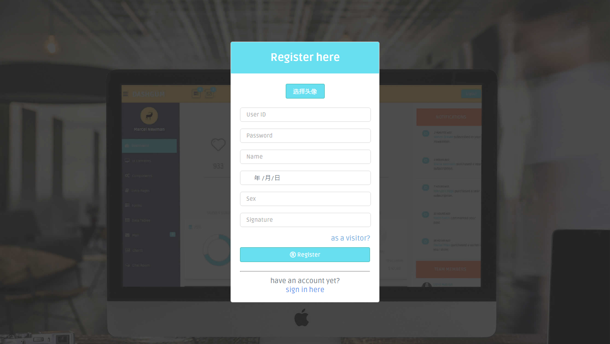
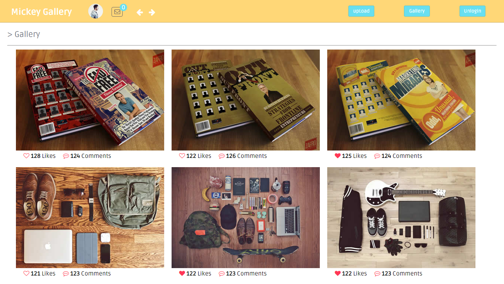
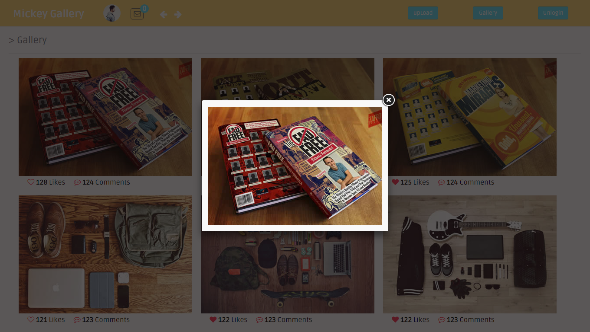
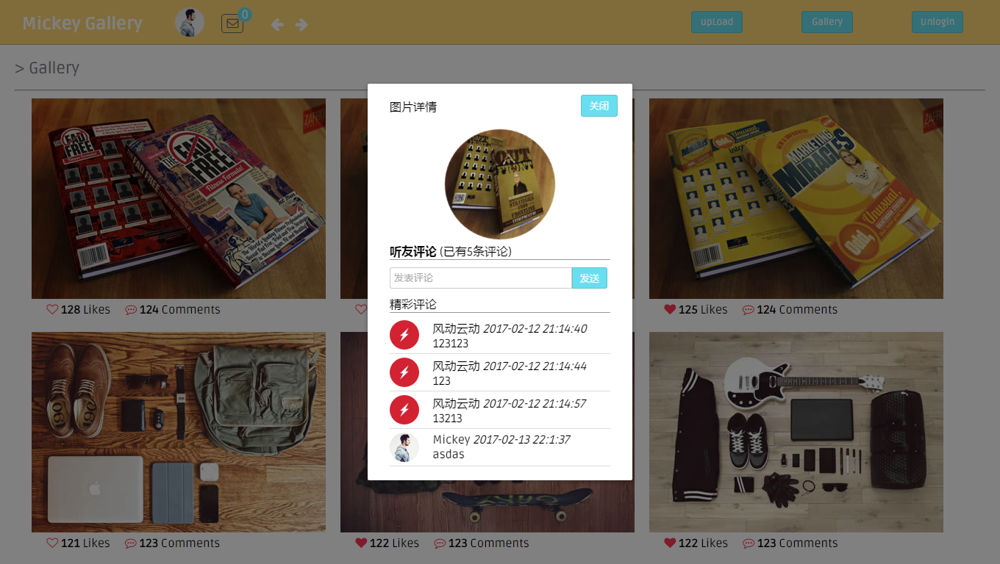
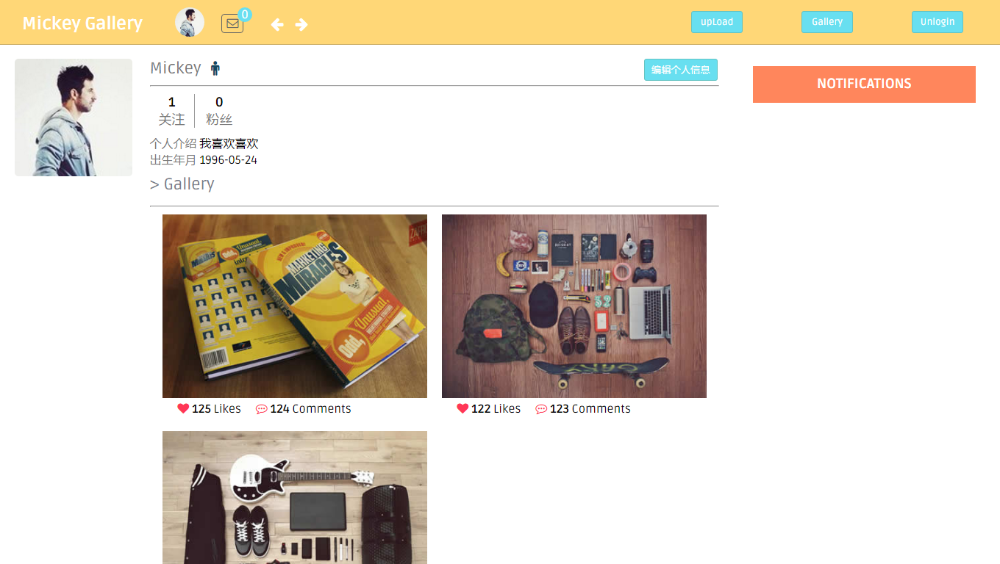
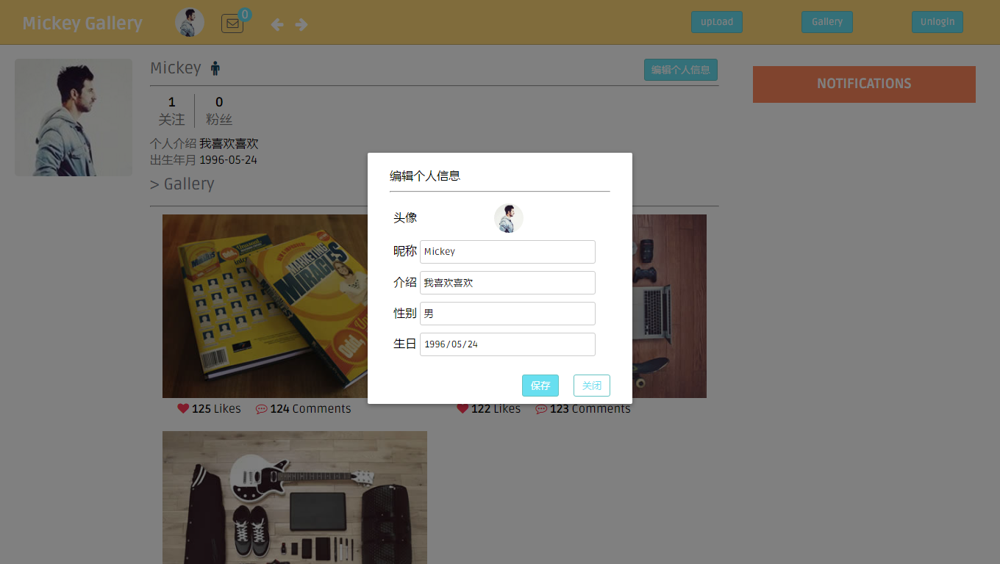

# Mickey-Gallery

> 一个前端基于Vue2.0全家桶，后台基于Express的前后端分离的图片鉴赏网站，由于第一次使用Vue和Nodejs做项目，还比较粗糙~

## 主要技术栈
1. vuejs2.0
2. vue-resource
3. vue-router
4. nodejs(express)

## 项目截图

**登陆界面**

**注册界面**

**游客登陆界面**

**用户登陆后界面**

**点击图片放大观看界面**

**图片详情界面**

**用户主页界面**

**用户修改个人信息界面**

## 如何使用
1. 下载或者clone到本地目录
2. cd 到server目录
3. npm install 安装依赖
4. node server.js开启服务器
5. cd 到项目根目录
6. npm install 安装vuejs等依赖
7. npm run dev

